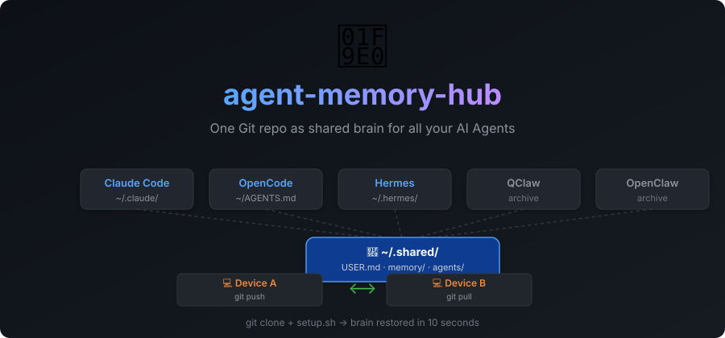
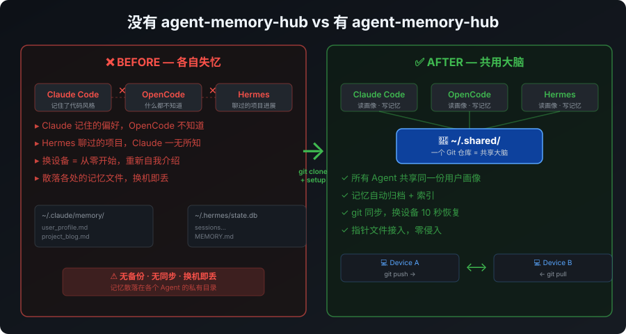
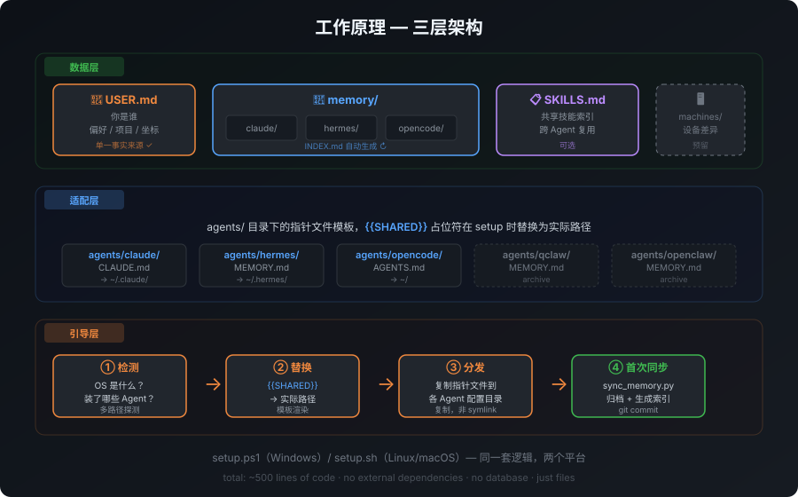
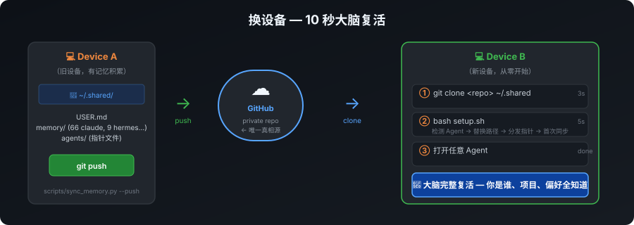

<p align="center">
  
</p>

<p align="center">
  <a href="https://github.com/Dream22180971/agent-memory-hub/blob/main/LICENSE">
    
  </a>
  
  
  
</p>

<p align="center">
  <code>git clone</code> + <code>bash setup.sh</code> = 大脑复活，10 秒。
</p>

---

## 🤔 它解决什么问题

<p align="center">
  
</p>

每个 AI Agent 默认各自失忆——Claude 记住的偏好 OpenCode 不知道，Hermes 聊过的项目 Claude 一无所知。换台设备就从零开始。

**agent-memory-hub 的答案：一个 Git 仓库当共享大脑，每个 Agent 放一个指针文件指向它。**

---

## ⚡ 快速开始

```bash
# 1. Fork 或 clone 到本地（建议放在 ~/.shared）
git clone https://github.com/<you>/agent-memory-hub.git ~/.shared

# 2. 运行安装脚本（自动检测你装了哪些 Agent，只为它们接入）
cd ~/.shared
bash setup.sh              # Linux / macOS
.\setup.ps1                # Windows PowerShell

# 3. 编辑 USER.md，告诉 Agent 们你是谁
```

装好后 **零维护**。Agent 按指针文件自动读画像、查记忆、写回新记忆。

日常同步（归档各 Agent 新产生的记忆 + git commit）：

```bash
python scripts/sync_memory.py --push
# Windows 用户也可以双击 sync.bat
```

---

## 🏗️ 三层架构

<p align="center">
  
</p>

| 层 | 目录 | 职责 |
|:---|:-----|:-----|
| 🟢 数据层 | `USER.md` `memory/` `SKILLS.md` | 记忆本体：画像 + 各 Agent 记忆归档 + 共享技能 |
| 🔵 适配层 | `agents/` | 每个 Agent 一份指针文件模板，`{{SHARED}}` 占位符 |
| 🟠 引导层 | `setup.ps1` / `setup.sh` | 检测 OS → 检测 Agent → 替换路径 → 分发指针 |

**指针文件 = 接入的全部代价。** setup 把模板里的 `{{SHARED}}` 替换为实际路径，复制到各 Agent 的约定位置。

```
~/.shared/                           ← 这个仓库 = 大脑本体
├── USER.md                          ← 你是谁（单一事实来源）
├── SKILLS.md                        ← 共享技能索引（可选）
├── memory/                          ── 数据层 ──
│   ├── INDEX.md                     自动生成的记忆索引
│   ├── claude/                      Claude 的记忆归档
│   ├── hermes/                      Hermes 的记忆归档
│   └── opencode/                    OpenCode 的记忆归档
├── agents/                          ── 适配层 ──
│   ├── claude/CLAUDE.md             指针模板
│   ├── hermes/MEMORY.md + USER.md   指针模板
│   ├── opencode/AGENTS.md           指针模板
│   ├── qclaw/MEMORY.md              指针模板（归档）
│   └── openclaw/MEMORY.md           指针模板（归档）
├── setup.ps1 / setup.sh             ── 引导层 ──
├── scripts/sync_memory.py           归档 + 索引 + git commit
├── sync.bat                         Windows 一键同步
└── machines/                        设备差异层（预留）
```

---

## 🤖 支持的 Agent

| Agent | 检测方式 | 指针位置 | 状态 |
|:------|:---------|:---------|:-----|
| **Claude Code** | `~/.claude` | `~/.claude/CLAUDE.md` | ✅ 活跃 |
| **OpenCode** | `opencode` 命令 / `~/.config/opencode` | `~/AGENTS.md` | ✅ 活跃 |
| **Hermes** | `~/.hermes` / `~/.config/hermes` / `%LOCALAPPDATA%\hermes` | `<hermes>/MEMORY.md` + `USER.md` | ✅ 活跃 |
| **QClaw** | `~/.qclaw/workspace` | `workspace/MEMORY.md` | 📦 归档 |
| **OpenClaw** | `~/.openclaw/workspace` | `workspace/MEMORY.md` | 📦 归档 |

> **新增 Agent = 3 行代码。** 在 `agents/` 加模板目录 + setup 加检测逻辑。欢迎 PR。

---

## 🔄 换设备

<p align="center">
  
</p>

```bash
git clone git@github.com:<you>/my-memory-hub.git ~/.shared
cd ~/.shared && bash setup.sh        # 或 .\setup.ps1
```

10 秒后，大脑完整复活。想要 **全新大脑**（不带历史记忆）？

```bash
bash setup.sh --fresh    # 只保留骨架，清除所有积累的记忆
```

---

## 🔐 安全第一

> ⚠️ **你的记忆是隐私数据。** 本仓库只是骨架模板，克隆后请立即转成你自己的私有仓库。

```bash
# 删掉指向模板仓库的 remote，换成你自己的私有仓库
git remote remove origin
gh repo create my-memory-hub --private
git remote add origin git@github.com:<you>/my-memory-hub.git
git push -u origin main
```

`.gitignore` 已排除 `sync_state.json`（机器本地状态）。`memory/` 下的记忆文件只存在于你自己的私有仓库。

---

## 🧠 工作原理

```
┌─────────────┐     ┌─────────────┐     ┌─────────────┐
│ Claude Code │     │   Hermes    │     │  OpenCode   │
│             │     │             │     │             │
│  读: 指针 ──┼──→  │  读: 指针 ──┼──→  │  读: 指针 ──┼──→ ~/.shared/USER.md
│  写: 记忆 ──┼──→  │  写: 记忆 ──┼──→  │  写: 记忆 ──┼──→ ~/.shared/memory/
└─────────────┘     └─────────────┘     └─────────────┘
                              │
                    sync_memory.py
                    归档 → 索引 → git commit
                              │
                         git push → 多设备同步
```

1. **指针文件** 被 setup 分发到各 Agent 的配置目录
2. Agent 每次会话启动时读指针 → 读 `USER.md` 画像 → 查 `memory/INDEX.md`
3. 新的长期记忆写入 `memory/<agent>/`
4. `sync_memory.py` 归档 + 生成索引 + git commit（`--push` 可选）

---

## ❓ 设计决策

<details>
<summary><strong>为什么不用 mem0 / Letta / basic-memory？</strong></summary>

它们解决的是"语义检索"（向量数据库、知识图谱）。在几百个 md 文件的规模下，`INDEX.md` + Agent 自己 grep 完全够用。等到不够用那天，这类服务可以无痛叠加——md 文件仍是真相源。

</details>

<details>
<summary><strong>为什么指针文件用复制，不用 symlink？</strong></summary>

Windows 上建文件级 symlink 需要开发者模式；更致命的是 Agent 卸载/重装后 symlink 变死链且难以察觉。复制 + `-Force` 重新分发，没有这些问题。

</details>

<details>
<summary><strong>为什么 git commit 写在 sync 脚本里，而不是 git hooks？</strong></summary>

git hooks 只在 git 操作时触发，监听不到 Agent 直接写文件。同步脚本末尾 commit（`--no-git` 可跳过）+ 定时任务，才是可靠路径。

</details>

<details>
<summary><strong>自动同步？</strong></summary>

- **Windows**：任务计划程序每天跑一次 `sync.bat`
- **Linux / macOS**：`cron` 定时执行 `python3 scripts/sync_memory.py --push`

</details>

---

## 📁 目录结构

```
agent-memory-hub/
├── README.md                ← 你在读的这个
├── LICENSE                  ← MIT
├── USER.md                  ← 用户画像模板（填你自己的）
├── SKILLS.md                ← 共享技能索引模板
├── .gitignore
│
├── agents/                  ← 各 Agent 的指针文件模板
│   ├── claude/CLAUDE.md
│   ├── hermes/MEMORY.md + USER.md
│   ├── opencode/AGENTS.md
│   ├── qclaw/MEMORY.md
│   └── openclaw/MEMORY.md
│
├── memory/                  ← 记忆数据（使用后自动积累）
│   └── README.md
│
├── docs/images/             ← 架构图 & 示意图
│   ├── hero-banner.svg
│   ├── before-after.svg
│   ├── architecture.svg
│   └── cross-device.svg
│
├── machines/                ← 设备差异层（预留）
│   └── README.md
│
├── scripts/
│   └── sync_memory.py       ← 归档 + 索引 + git commit
│
├── setup.ps1                ← Windows 安装脚本
├── setup.sh                 ← Linux / macOS 安装脚本
└── sync.bat                 ← Windows 一键同步
```

---

## 🤝 Contributing

欢迎 PR：

- 新增 Agent 适配（`agents/<name>/` + setup 检测逻辑）
- 改进同步脚本（增量同步、冲突处理等）
- 文档改进

## 📄 License

[MIT](LICENSE) — 随便用，随便改。
