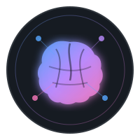

<div align="center">



# agent-memory-hub

**用一个 Git 仓库，让多个 AI Agent 共用一套记忆。**

[English](./README.md) | [简体中文](./README.zh-CN.md)

[](#快速开始)
[](https://www.python.org/)
[](#支持的-agent)
[](LICENSE)

</div>

---

## 它解决什么问题

不同 AI Agent 往往各自保存偏好、项目上下文和长期记忆。换一个工具，或者换一台电脑，之前积累的上下文就重新碎片化。

**agent-memory-hub 用一个 Git 仓库作为共享记忆层，再通过很薄的指针文件把这套记忆接入不同 Agent。**

<p align="center">
  
</p>

---

## 快速开始

```bash
git clone https://github.com/Dream22180971/agent-memory-hub.git ~/.shared
cd ~/.shared

bash setup.sh
# Windows PowerShell: .\setup.ps1
```

然后编辑 `USER.md`，写入你希望多个 Agent 共同读取的画像与上下文。

日常同步：

```bash
python scripts/sync_memory.py --push
```

---

## 架构

<p align="center">
  
</p>

| 层 | 文件 | 职责 |
|---|---|---|
| **数据层** | `USER.md`、`memory/`、`SKILLS.md` | 用户画像、长期记忆、共享技能 |
| **适配层** | `agents/` | 不同 Agent 的指针模板 |
| **引导层** | `setup.ps1`、`setup.sh` | 检测 Agent 并分发指针 |

仓库本身始终是真相源，Agent 专属文件只负责指向它。

---

## 支持的 Agent

| Agent | 状态 | 指针位置 |
|---|---:|---|
| Claude Code | ✅ 活跃 | `~/.claude/CLAUDE.md` |
| OpenCode | ✅ 活跃 | `~/AGENTS.md` |
| Hermes | ✅ 活跃 | 配置目录中的 `MEMORY.md` + `USER.md` |
| QClaw | 📦 归档 | workspace memory pointer |
| OpenClaw | 📦 归档 | workspace memory pointer |

---

## 换设备

<p align="center">
  
</p>

```bash
git clone git@github.com:<you>/my-memory-hub.git ~/.shared
cd ~/.shared
bash setup.sh
```

同一份仓库可以在新设备上恢复共享画像、记忆索引和 Agent 适配文件。

---

## 隐私

长期记忆可能包含私人信息和项目上下文。

实际使用时，建议把模板复制到你自己的 **私有仓库**，不要把真实个人记忆长期放在公共模板仓库。

```bash
git remote remove origin
gh repo create my-memory-hub --private
git remote add origin git@github.com:<you>/my-memory-hub.git
git push -u origin main
```

---

## 为什么先用 Git，而不是向量数据库

这个项目优先解决“小规模、透明、可控”的共享记忆问题：

- Markdown 人能直接读。
- Git 自带版本历史与跨设备同步。
- Agent 可以直接检索文件。
- 如果规模变大，后续仍可以叠加向量检索。

它不是为了替代所有 Memory Framework，而是先提供一个简单可靠的真相源。

---

## 项目结构

```text
agent-memory-hub/
├── USER.md
├── SKILLS.md
├── memory/
├── agents/
│   ├── claude/
│   ├── hermes/
│   ├── opencode/
│   ├── qclaw/
│   └── openclaw/
├── scripts/
│   └── sync_memory.py
├── setup.ps1
├── setup.sh
└── sync.bat
```

---

## 路线图

- [x] Git 共享记忆骨架
- [x] 跨平台安装脚本
- [x] 多 Agent 适配
- [x] 记忆索引与同步
- [ ] 更多活跃 Agent 适配
- [ ] 更好的冲突处理
- [ ] 可选定时同步辅助
- [ ] 可选语义检索层

---

## 参与贡献

欢迎新增 Agent 适配、安装脚本改进、同步可靠性修复和文档 PR。

---

## License

[MIT](LICENSE)

<div align="center">

**一套记忆源，多种 Agent，少一点上下文重置。**

</div>
